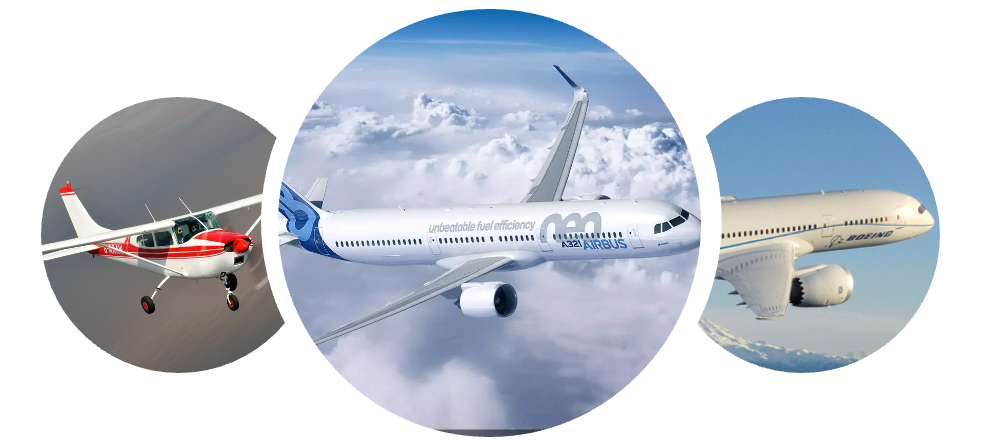
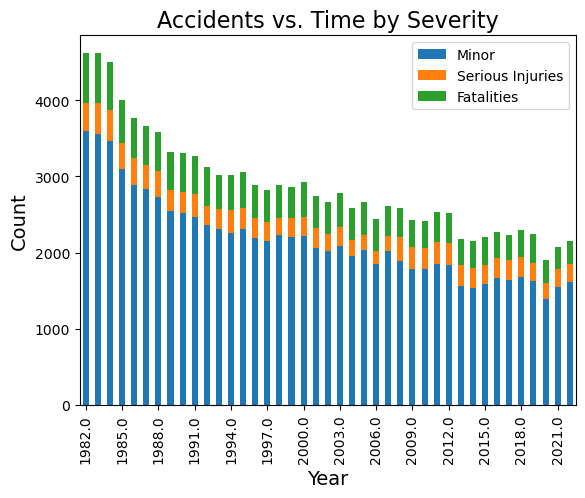
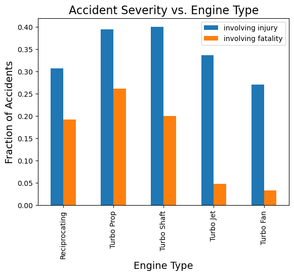
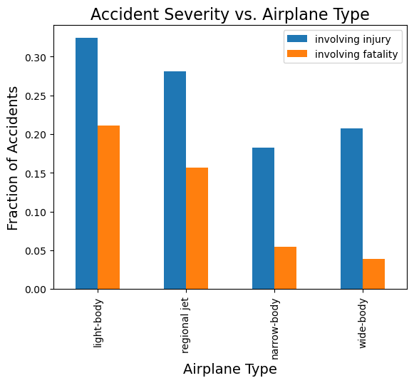
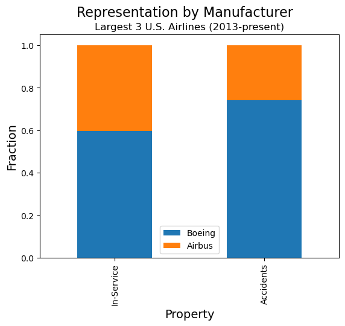

# Airplane Safety Analysis 

**Author**: Jeffrey Goett

## Business Problem 

A company would like to purchase and lease airplanes, and wants to identify which features of an airplane are tied to its relative safety. When considering the safety of an aircraft, we will look at two different dimensions - how frequently is an airplane involved in an accident, and when it is in an accident, how  severe are the accidents?  

Ideally, this study will help us identify airplanes that are not frequently involved in an accident, and when they are, minimize the severity of the accident.  

In particular, this study will look at three features of an airplane, and determine how they affect the airplane safety.  It will look at the Aviation Database from the NTSB and answer these three questions will be addressed:
- Is accident severity related to the type of engine used on the airplane?
- Is accident severity related to the size of the airplane?
- Is the frequency of accidents related to the manufacturer of the aircraft?

## Data Understanding

The National Transportation Safety Board Accident Database records every accident that has occurred in the United States since roughly 1982.  Each record includes the date of the accident, the make, model, and engine type of the airplane involved, and the number of serious injuries and fatalities resulting from the accident.  

This study will consider an accident to be serious if it involves one or more serious injuries, and an accident to be fatal if it involves one or more fatalities.

Additional data on each model of airplane is imported.  This helps to identify the category of airplane (narrow-body or wide-body), and whether the airplane is currently in production.  

## Data Analysis
### Accident Severity vs. Engine Type
We consider whether the type of airplane engine has a relationship to the severity of accident the plane is involved in.  Based on the graph below, we see a strong correlation between the type of engine and the proportion of fatal accidents an airplane is involved in.  Both turbo jet and turbo fan engine types are associated with fewer accidents involving fatalities.  



### Accident Severity vs. Aircraft Type
We consider whether the type of airplane has a relationship to the severity of accident the plane is involved in.  Based on the graph below, we see a strong correlation between the type of airplane and the proportion of fatal accidents an airplane is involved in.  There is also a correlation between the type of airplane and the proportion of accidents involving an injury.  


### Accident Frequency vs. Make
Finally, we would like to consider whether Boeing or Airbus airplanes are involved in accidents more frequently.  We compare the relative number of Boeing and Airbus planes in service vs. the relative number of accidents they are involved in.
From the graph below, we see that Boeing aircraft are over-represented in the number of accidents logged by the top 3 carriers.  While 60% of the aircraft the carriers fleets are Boeing aircraft, 75% of accidents logged by the carries involved Boeing airplanes.  


## Tableau Visualization

See the [Tableau visualization ](https://public.tableau.com/app/profile/jeffrey.goett/viz/TableauAirplaneRecommendations/AccidentDashboard)

## Repository Structure

```
|── code
│   ├── __init__.|py
│   ├── data_preparation.py
├── data
├── images
├── README.md
├── Presentation.pdf
├── Presentation.pptx
└── AirplaneAnalysis.ipynb
```
